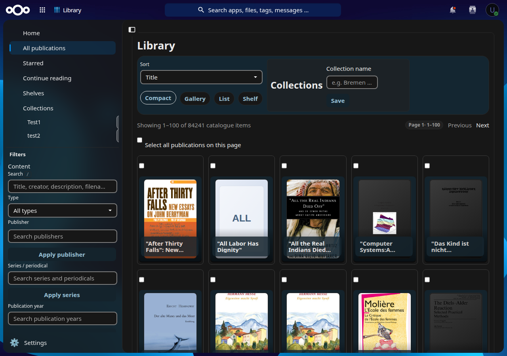

# Library

Library is an open-source Nextcloud app for people who keep books, comics, papers and sidecar metadata in Nextcloud Files.

Nextcloud Files remains the canonical storage. Library indexes those files with a file-ID-based index and adds a catalogue on top: covers, search, filters, shelves, saved collections, detail editing, review queues and handoff to the normal Nextcloud file viewers.



License: AGPL-3.0-or-later. See [LICENSE](LICENSE).

## What it does

Current candidate: `0.1.0-alpha.174`. This is an alpha for Nextcloud 34, meant for private testing with real collections. Packages are unsigned for now.

What works today:

- scan folders already visible in Nextcloud Files;
- browse a cover-first catalogue and cover gallery in compact, gallery, shelf or list view;
- search and filter titles, creators, series, descriptions, identifiers, file names and folders;
- filter by type, format, year, creator, publisher, subject, classification, tag, scan state, workflow state and review flags;
- use typeahead for large lists such as creators, publishers, series, subjects and folders;
- save the current filter setup as a collection and reopen it from the navigation;
- open the file in the normal Nextcloud viewer, show it in Files or Download it;
- edit catalogue metadata, workflow status, stars, descriptions and file comments;
- review weak metadata, scanner conflicts, missing files and metadata extraction errors;
- export corrected metadata and preview imports before applying them.

The app has safe user-facing diagnostics for scan and metadata problems. Server logs keep the technical detail.

## Current scope

Library keeps source files in place. Scans and edits write to Library-owned tables and metadata records. Metadata import has a preview step before anything is applied.

Not in v0.1:

- a built-in EPUB, PDF or comic reader;
- reading-position sync or annotations;
- OCR or full-text document search;
- internet metadata lookup;
- OPDS, Kobo or Kindle sync;
- AI classification;
- shared or admin-managed library roots.

## Install

Install a packaged archive as a Nextcloud administrator:

```bash
tar -xzf library-<version>.tar.gz -C /var/www/html/custom_apps
chown -R www-data:www-data /var/www/html/custom_apps/library
sudo -u www-data php /var/www/html/occ app:enable library
```

The archive must contain one top-level `library/` directory. Paths and the web-server user vary by installation. Container setups can run the same commands through `docker exec`.

After enabling the app, open **Library settings**, add a folder that already exists in Nextcloud Files, then run **Scan this root**.

## Try it

From a source checkout with Node 24/npm 11:

```bash
npm ci
scripts/package-release.sh
```

Install `dist/library-<version>.tar.gz` with the archive commands above. Verify a packaged candidate with its adjacent `.sha256` artifact; detailed release evidence stays in the excluded `RELEASE.md`.

Useful checks:

```bash
npm run check
npm run smoke:release-package
```

`bin/nextcloud-background-worker.sh` runs the general Nextcloud background worker for a bounded development pass when scan jobs need queue processing.

For GUI workflows, install the pinned browsers once with `npx playwright install chromium firefox`, then run `npm run test:gui`. Set `PW_BASE_URL`, `PW_USER`, `PW_PASSWORD` and fixture variables when using a disposable instance.

## More documentation

- [User and admin guide](docs/user-guide.md), [FAQ and troubleshooting](docs/faq.md), [Human test handbook](docs/human-test-handbook.md), [Public alpha test checklist](docs/alpha-test-checklist.md)
- [Current state and risk register](docs/current-state-and-risk-register.md), [Active roadmap](docs/roadmap.md), [Post-v0.1 roadmap](docs/post-v0.1-roadmap.md), [Personal top features scope](docs/personal-top-features.md)
- [Product concept](docs/product-concept.md), [UX concept](docs/ux-concept.md), [Usefulness and UX feature list](docs/usefulness-and-ux-feature-list.md)
- [Release process](RELEASE.md), [Changelog](CHANGELOG.md), [App Store listing draft](docs/app-store-listing.md), [App Store readiness roadmap](docs/app-store-readiness.md)
- [Metadata storage and Nextcloud integration](docs/metadata-storage.md), [Human architecture review notes](docs/architecture-review.md)
